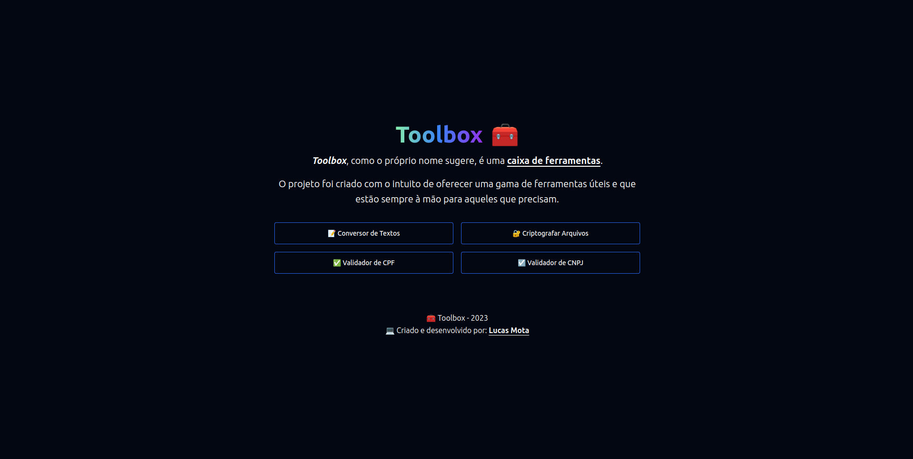

<h1 align="center"> 🧰 Toolbox </h1>

  A sua caixa de ferramentas para cartórios

  <a href="#-tecnologias">Tecnologias</a>&nbsp;&nbsp;&nbsp;|&nbsp;&nbsp;&nbsp;
  <a href="#-projeto">Projeto</a>

 

  

## 🚀 Tecnologias

O projeto foi desenvolvido com as seguintes tecnologias:

- JavaScript
- React JS + Vite
- React Router DOM
- Tailwind CSS

## 💻 Projeto

Este é um projeto criado com o intuito de reunir ferramentas úteis para o dia a dia de trabalho no meu emprego atual (trabalho em um cartório).

O projeto conta com as seguintes ferramentas:

- Conversor de Textos (converte textos de maiúscula para minúscula e vice-versa - acredite, é muito útil!)
- Hash de arquivos utilizando **SHA256**
- Validador de CPF
- Validador de CNPJ

---

🧑🏾‍💻 Criado e desenvolvido por **Lucas Mota**
