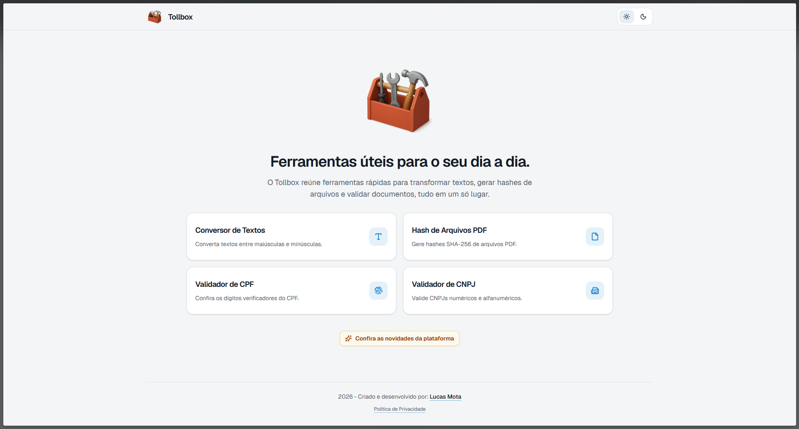

# Tollbox

Uma caixa de ferramentas simples para resolver tarefas do dia a dia diretamente no navegador.

<p align="center">
  
</p>

## Sobre o projeto

O Tollbox reúne ferramentas rápidas para transformar textos, gerar hashes de arquivos e validar documentos, tudo em um só lugar. A aplicação foi pensada para ser direta, agradável de usar e acessível para qualquer pessoa.

## Ferramentas disponíveis

- **Conversor de textos:** transforma um texto em maiúsculas ou minúsculas.
- **Hash de arquivos PDF:** gera o hash SHA-256 de um arquivo PDF no próprio navegador.
- **Validador de CPF:** confere o formato e os dígitos verificadores de um CPF.
- **Validador de CNPJ:** valida CNPJs tradicionais e CNPJs alfanuméricos.

## Privacidade

Os textos, CPFs, CNPJs e arquivos usados nas ferramentas são processados localmente no navegador. O Tollbox não envia esses dados para servidores próprios nem os armazena.

A escolha do tema claro ou escuro é salva apenas no navegador para que a preferência seja lembrada no próximo acesso. Consulte a [Política de Privacidade](https://lmdvlpr-toolbox.vercel.app/politica-de-privacidade) para saber mais.

## Novidades

Nesta versão, o Tollbox recebeu:

- novo visual com layout mais organizado e confortável;
- suporte aos temas claro e escuro;
- nova tipografia e identidade visual;
- animações leves para melhorar a navegação;
- validação de CNPJs no formato tradicional e alfanumérico;
- uma página de novidades para acompanhar as atualizações;
- uma página de Política de Privacidade;
- uma página 404 personalizada;
- mensagens de ajuda, sucesso e erro mais claras.

O novo formato de CNPJ segue as orientações da [Receita Federal](https://www.gov.br/receitafederal/pt-br/acesso-a-informacao/acoes-e-programas/programas-e-atividades/cnpj-alfanumerico) e a Instrução Normativa RFB nº 2.229/2024. Os CNPJs numéricos já existentes continuam válidos.

## Tecnologias

- TypeScript
- React
- Vite
- React Router DOM
- Tailwind CSS
- shadcn/ui
- Lucide React
- Motion
- Web Crypto API

## Como executar

É necessário ter o Node.js 20 ou superior instalado.

```bash
npm ci
npm run dev
```

Para verificar o projeto:

```bash
npm run lint
npm test
npm run build
npm audit --audit-level=high
```

## Principais rotas

- `/` — página inicial;
- `/conversor-de-textos` — conversor de textos;
- `/hash-de-arquivos` — hash de arquivos PDF;
- `/validador-de-cpf` — validador de CPF;
- `/validador-de-cnpj` — validador de CNPJ;
- `/novidades` — changelog da plataforma;
- `/politica-de-privacidade` — política de privacidade.

---

Criado e desenvolvido por [**Lucas Mota**](https://www.lmdvlpr.com/).
